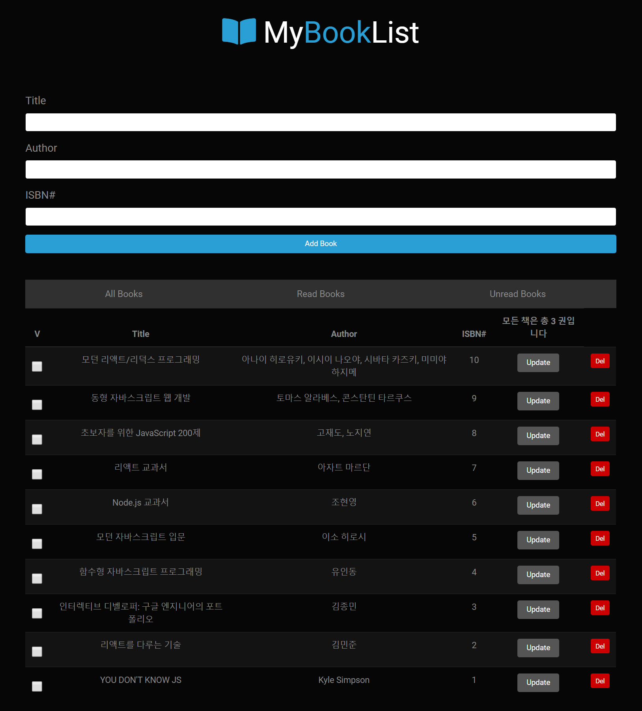
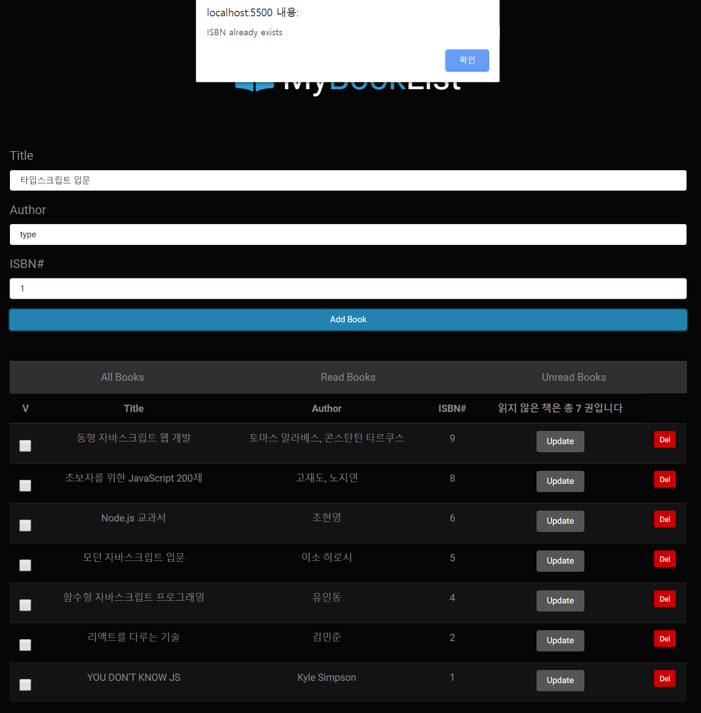
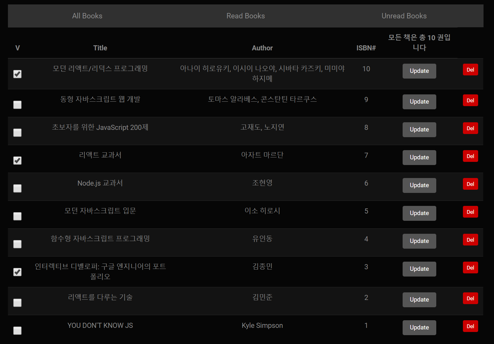
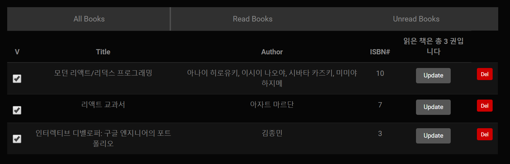
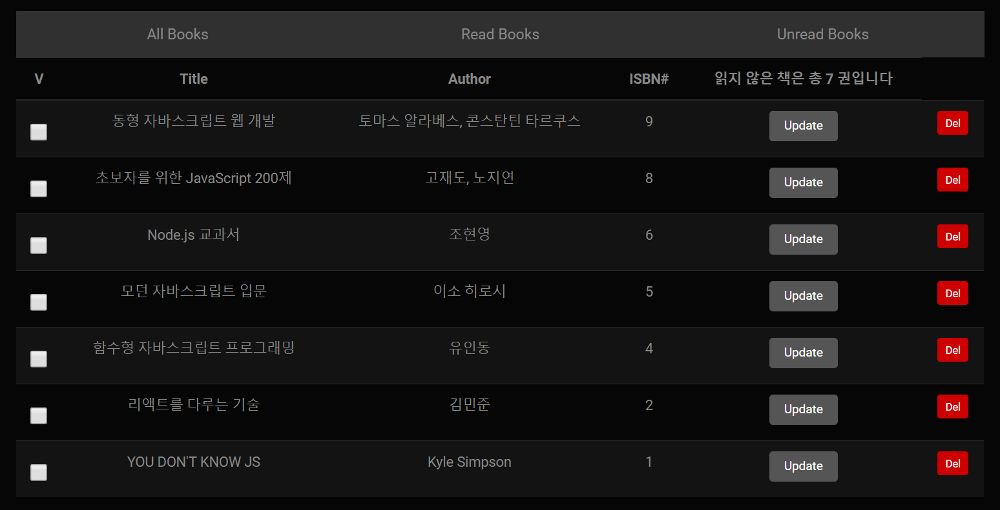

# MyBookApp
* CRUD가 가능한 도서관리 앱입니다.
* jQuery는 사용하지 않았으며 vanillaJS로 구현하였습니다.
* localStorage를 활용하여 새로고침이 발생하여도 기존에 입력한 데이터는 유지됩니다.
* 빈칸 및 동일한 ISBN은 등록 및 수정을 할 수 없는 Validation 과정이 있습니다.
* 모든 책, 읽은 책, 읽지 않은 책을 CheckBox로 제어 가능하며 각각 확인이 가능합니다.
* CSS는 https://bootswatch.com/ 의 완성된 CSS를 활용하였습니다.

# ScreenShot

■ Index

    

■ Validation

    

    

■ allBooks

    

■ readBooks

    

■ unreadBooks

    

■ localStorage

    

